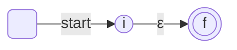
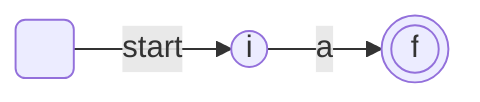

# Thompson 构造法

Thompson 构造法[^1]将一个正则表达式转化为一个与之等价的非确定有限状态机（NFA）。

[^1]: Ken Thompson. Programming Techniques: Regular expression search algorithm. Commun. ACM 11, 6 (June 1968), 419–422. [https://doi.org/10.1145/363347.363387](https://doi.org/10.1145/363347.363387)

## 构造规则

Thompson 构造法将正则表达式划分为构成它的子表达式，通过得到子表达式的 NFA 和子表达式之间的运算关系构造表达式自身的 NFA

### 空表达式



### 单个符号



### 子表达式构造

- 两个正则表达式的并 $s|t$

    ```mermaid
    flowchart LR
        S( ) -- start --> A((i))
        A -- ε --> NsA
        A -- ε --> NtA
      
        subgraph "N(s)"
            NsA(( )) -.- NsB(( ))
        end

        subgraph "N(t)"
            NtA(( )) -.- NtB(( ))
        end

        NsB -- ε --> B(((f)))
        NtB -- ε --> B

    ```

- 两个正则表达式的连接 $st$

    可以将 $N(s)$ 和 $N(t)$ 用 $ε$ 边连接并添加新初态 $i$ 和新终态 $f$：
    ```mermaid
    flowchart LR
        S( ) -- start --> A((i))
        A -- ε --> NsA
      
        subgraph "N(s)"
            NsA(( )) -.- NsB(( ))
        end
        NsB -- ε --> NtA
        subgraph "N(t)"
            NtA(( )) -.- NtB(( ))
        end

        NtB -- ε --> B(((f)))

    ```

    也可以将 $N(s)$ 和 $N(t)$ 叠加，将 $N(s)$ 初态作为新初态，将 $N(t)$ 终态作为新终态，$N(s)$ 终态与 $N(t)$ 初态合并。

- 对于 $s*$：
    
    ```mermaid
    flowchart LR
        S( ) -- start --> A((i))
        A -- ε --> NsA
      
        subgraph "N(s)"
            NsB -- ε --> NsA
            NsA(( )) -.- NsB(( ))
        end

        NsB -- ε --> B(((f)))
        A -- ε --> B
    ```

- 对于加括号的表达式 (s) 直接转化为 N(s) 自身即可

## 算法特性

- 每个步骤最多增加两个新状态 → $N(e)$ 的状态数小于等于 $e$ 的符号数加操作符数的两倍
- $N(e)$ 有且只有一个初态和一个终态
- $N(e)$ 的每一个状态，有以下两种情况
  - 有一条边标记为某个 $a\in\Sigma$ 的输出边
  - 至多有两条 $ε$ 输出边

## Thompson 构造法举例

使用 Thompson 构造法构造 $(ab*c)|(a(b|c*))$ 的 NFA：

- $r_0$
    ```mermaid
    flowchart LR
        S( )  --> A(( )) -- a --> B((( )))
    ```

- $r_1$
    ```mermaid
    flowchart LR
        S( )  --> A(( )) -- b --> B((( )))
    ```

- $r_2:r_1*$
    ```mermaid
    flowchart LR
        S( ) -- start --> A(( ))
        A -- ε --> NsA
      
            NsB -- ε --> NsA
            NsA(( )) -- b --> NsB(( ))

        NsB -- ε --> B((( )))
        A -- ε --> B
    ```

- $r_3:r_0r_2$
    ```mermaid
    flowchart LR
        S( ) -- start --> A(( ))
        A -- a --> B(( ))
        B -- ε --> NsA
      
            NsB -- ε --> NsA
            NsA(( )) -- b --> NsB(( ))

        NsB -- ε --> C((( )))
        B -- ε --> C
    ```

- $r_4$
    ```mermaid
    flowchart LR
        S( )  --> A(( )) -- c --> B((( )))
    ```

- $r_5:r_3r_4$
    ```mermaid
    flowchart LR
        S( ) -- start --> A(( ))
        A -- a --> B(( ))
        B -- ε --> NsA
      
            NsB -- ε --> NsA
            NsA(( )) -- b --> NsB(( ))

        NsB -- ε --> C(( ))
        B -- ε --> C
        C -- c --> D((( )))
    ```

- $r_6$
    ```mermaid
    flowchart LR
        S( )  --> A(( )) -- a --> B((( )))
    ```

- $r_7$
    ```mermaid
    flowchart LR
        S( )  --> A(( )) -- b --> B((( )))
    ```
- $r_8$
    ```mermaid
    flowchart LR
        S( )  --> A(( )) -- c --> B((( )))
    ```

- $r_9:r_8*$
    ```mermaid
    flowchart LR
        S( ) -- start --> A(( ))
        A -- ε --> NsA
      
            NsB -- ε --> NsA
            NsA(( )) -- c --> NsB(( ))

        NsB -- ε --> B((( )))
        A -- ε --> B
    ```
  
- $r_{10}:r_7|r_9$
    
    ```mermaid
    flowchart LR
        S( ) -- start --> A(( ))
        A -- ε --> D(( ))

        D -- b --> E(( ))

        A -- ε --> B(( ))

        B(( )) -- ε --> NsA
            NsB -- ε --> NsA
            NsA(( )) -- c --> NsB(( ))
        NsB -- ε --> C(( ))
        B -- ε --> C

        E -- ε ---> F((( )))
        C -- ε --> F
    ```

- $r_{11}:r_6(r_{10})$
    ```mermaid
    flowchart LR
        S( ) -- start --> G(( ))
        G -- a --> A(( ))
        A -- ε --> D(( ))

        D -- b --> E(( ))

        A -- ε --> B(( ))

        B(( )) -- ε --> NsA
            NsB -- ε --> NsA
            NsA(( )) -- c --> NsB(( ))
        NsB -- ε --> C(( ))
        B -- ε --> C

        E -- ε ---> F((( )))
        C -- ε --> F
    ```

- $r_{12}:r_5|r_{11}$ 得到最终结果


    ```mermaid
    flowchart LR
        S( ) -- start --> H((1))
        
        H -- ε --> A5((2))
        A5 -- a --> B5((3))
        B5 -- ε --> NsA5
      
            NsB5 -- ε --> NsA5
            NsA5((4)) -- b --> NsB5((5))

        NsB5 -- ε --> C5((6))
        B5 -- ε --> C5
        C5 -- c --> D5((7))


        H -- ε --> G((8))
        G -- a --> A((9))
        A -- ε --> D((10))

        D -- b --> E((11))

        A -- ε --> B((12))

        B -- ε --> NsA
            NsB -- ε --> NsA
            NsA((13)) -- c --> NsB((14))
        NsB -- ε --> C((15))
        B -- ε --> C

        E -- ε ---> F((16))
        C -- ε --> F

        D5 -- ε --> I(((17)))
        F -- ε --> I
    ```

