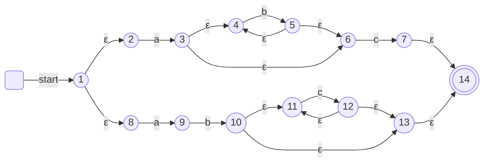
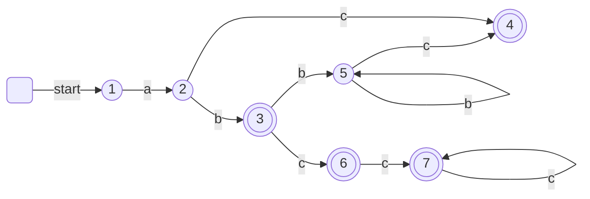

# 子集构造法

子集构造法（Subset Construction）是将 NFA 转换为 DFA 的一种算法。

NFA 对于特定输入字符串输出一个状态集合，而 DFA 则输出一个状态。对于 NFA，判断最后状态集合与接受的状态集合是否有交集即可判断是否接受字符串，而对于 DFA，则是判断最后的状态是否属于可接受的状态集合中。

## 对 NFA 状态的操作

|                         操作 | 描述                                                                   |
| ---------------------------: | ---------------------------------------------------------------------- |
| $\epsilon\text{-}closure(s)$ | 状态 $s$ 及从状态 $s$出发仅通过 $\varepsilon$ 边可以到达的所有状态集合 |
|                $\delta(s,a)$ | 从状态 $s$ 开始对 $a$ 状态转移得到新状态                               |
| $\epsilon\text{-}closure(T)$ | $\bigcup \epsilon\text{-}closure(s), s\in T$                           |
|                $\delta(T,a)$ | $\bigcup \delta(s,a), s\in T$                                          |

## 算法

### 计算 ε 闭包的算法

???+ note

    计算 $\epsilon\text{-}closure(T)$

    1. 将 $T$ 中所有状态压栈

    2. $\epsilon\text{-}closure(T) \leftarrow T$

    3. 重复执行直到栈为空：

        1. 弹出状态 $t$

        2. 对于每一个状态 $u$，如果 $t$ 到 $u$ 有一条 $\varepsilon$ 边且 $u\notin\epsilon\text{-}closure(T)$ 中，则
            1.  $\epsilon\text{-}closure(T) \leftarrow \epsilon\text{-}closure(T) \cup \{u\}$
            2.  将 $u$ 入栈

### NFA 转换为 DFA

???+ note

    将 NFA 转换为 DFA

    |  集合    |      含义     |
    | ----- | --------------- |
    | $D_s$ | DFA 的状态集     |
    | $D_t$ | DFA 状态转换矩阵 |

    初始时，$\epsilon\text{-}closure(s_0)$ 是 $D_s$ 中的唯一状态，并且没有标记

    1. 重复执行直到 $D_s$ 中不存在未标记状态
        1. 取出未标记状态 $T$ 并标记
        2. 对于每一个输入符号 $a$
           1. $U\leftarrow\epsilon\text{-}closure(\delta(T,a))$
           2. 若 $U\notin D_s$ 则将 $U$ 加入 $D_s$ 并设为未标记
           3. $D_t(T,a)=U$

    得到 $\epsilon\text{-}closure(s_0)$ 为初态，包含 NFA 终态的 DFA 状态为 DFA 的终态。

## 子集构造法举例

使用子集构造法将如下 NFA 转换为 DFA

状态转换矩阵如下

| NFA 状态集合                    | DFA 标记  | a   | b   | c   |
| ------------------------------- | --------- | --- | --- | --- |
| 1, 2, 8                         | 1         | 2   | -   | -   |
| 3, 4, 6, 9                      | 2         | -   | 3   | 4   |
| 5, 4, 6, 10, 11, 13, ==**14**== | ==**3**== | -   | 5   | 6   |
| 7, ==**14**==                   | ==**4**== | -   | -   | -   |
| 5, 4, 6                         | 5         | -   | 5   | 4   |
| 7, 11, 12, 13, ==**14**==       | ==**6**== | -   | -   | 7   |
| 11, 12, 13, ==**14**==          | ==**7**== | -   | -   | 7   |

得到转换后的 DFA

